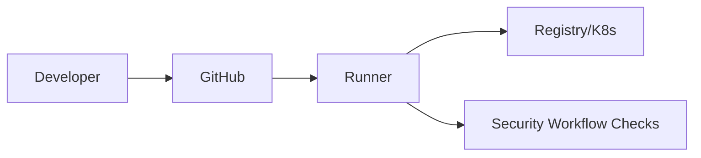

# CI Pipeline Threat Model

## Overview

Documents threats in GitHub Actions pipelines and shared workflows.

## Assets

- Workflow definitions
- Secrets
- Runners
- Logs

## Trust Boundaries

- Developer → GitHub → Runner → Registry/Kubernetes

## Threats & Mitigations

See threats.md for detailed list.

## Diagram Placeholder (Mermaid)

