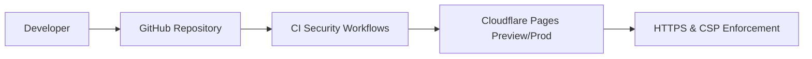

# Frontend Threat Model

## Overview

This folder documents threats to the frontend portfolio application hosted on Cloudflare Pages. It includes assets, trust boundaries, threats, mitigations, and CI validation steps.

## Assets

- Source code
- Build artifacts
- Cloudflare Pages configuration
- Public endpoints

## Trust Boundaries

- Browser ↔ Cloudflare
- Cloudflare ↔ build outputs

## Threats & Mitigations

See threats.md for detailed list.

## CI/CD Integration

Security workflows run in CI pipelines to detect XSS, dependency vulnerabilities, and exposure of secrets.

## Diagram Placeholder (Mermaid)

