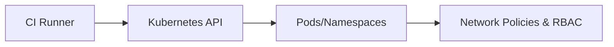

# Kubernetes Threat Model

## Overview

Documents threats and mitigations for Kubernetes clusters and workloads. Includes trust boundaries, assets, threats, mitigations, and validation.

## Assets

- Clusters, nodes, pods
- Secrets
- Ingress resources

## Trust Boundaries

- CI Runner → Kubernetes API
- Ingress → Services

## Threats & Mitigations

See threats.md for detailed list.

## Diagram Placeholder (Mermaid)

